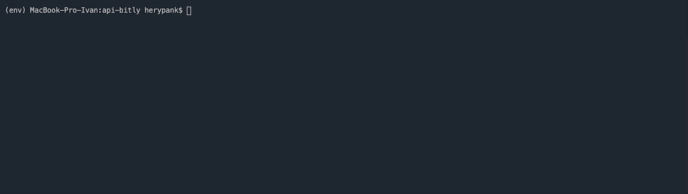
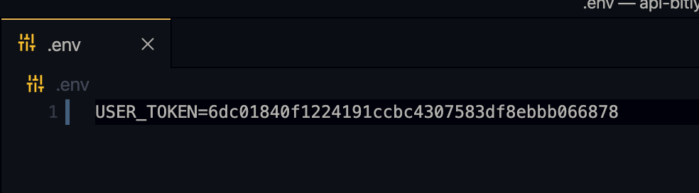

# CMD-bitly
 

## Описание проекта.   
Этот проект позволяет создать сокращённую ссылки. Посмотреть переходы по вашей сокращённой (bit.ly) ссылке через командную строку.     
## Пример использования.   

  
   
## Подготовка к запуску.  
Установить библиотеки командой.  
```
pip install -r requirements.txt  
```
    
[Сервис Bitly](https://bit.ly/) — зарегистрируйтесь
Создайте файл .env в надо прописать ваш bitly token его можно получить [**тут**](https://bitly.com/a/oauth_apps)   
   
**Пример**  
   

## Запуск кода.  
```
python3 request.py https://dvmn.org/modules/
```
**После request.py должна быть ваша ссылка**
